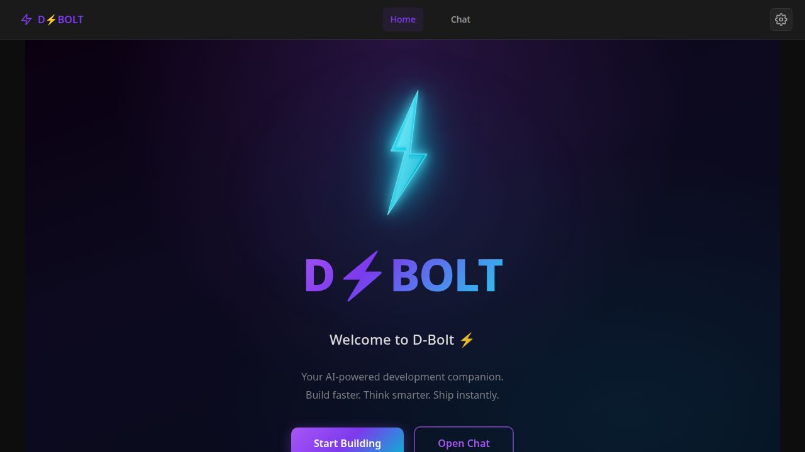
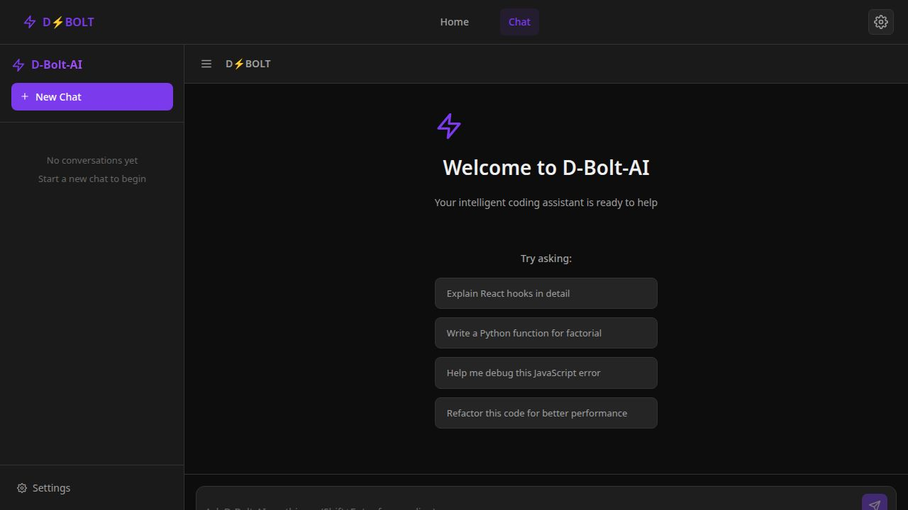
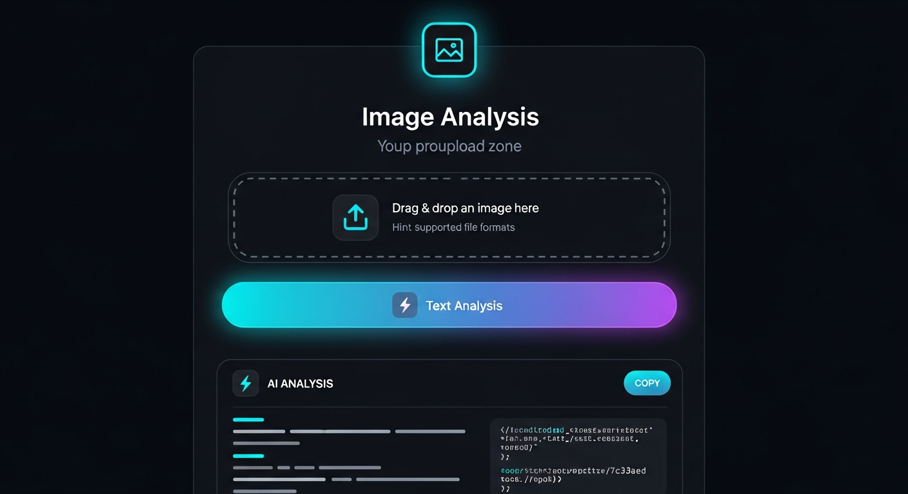

# D⚡BOLT — AI-Powered Coding & Developer Productivity Engine

> Build faster. Think smarter. Ship instantly.

> A premium, developer-focused AI productivity tool with real-time streaming, multi-model support, and GPT-4o powered image analysis. Built with React 18 + TypeScript + Vite, connected to the world's top AI models through OpenRouter.

---

## Overview

D⚡BOLT gives developers an instant, browser-based interface to the best AI coding models available. Chat with GPT-4o, Claude 3.5 Sonnet, and more — with responses that stream word-by-word, conversations that persist across sessions, and a futuristic dark UI designed for deep focus and fast iteration.

More than just a chat app, D⚡BOLT is built as a developer productivity tool: analyze screenshots and diagrams, switch models mid-session, export conversations, and get instant code suggestions — all without leaving the browser.

The home page also includes a standalone **Image Analysis** tool: drop any screenshot, diagram, or UI mockup and get a detailed, streaming AI breakdown in seconds — no separate tool required.

---

## ⚡ Why D⚡BOLT?

D⚡BOLT is built for developers who want speed, flexibility, and control when working with AI.

Unlike traditional AI chat tools, D⚡BOLT focuses on:
- Real-time streaming responses for faster iteration
- Multi-model flexibility via OpenRouter
- Built-in image analysis for debugging and UI breakdowns
- Persistent sessions and developer-focused workflows

It's not just AI chat — it's a development accelerator.

---

## Interface Preview

A quick look at the D⚡BOLT experience — from the entry Home Page to the real-time AI chat interface.

### Home Page


### Chat Interface


---

## 🏠 Home Page

The D⚡BOLT home page is a full-screen, modern hero interface designed to make a strong first impression and get developers into the tool immediately.

- **Full-screen hero layout** — Vertically and horizontally centered content that fills the entire viewport
- **D⚡BOLT branding** — Large gradient title (purple → violet → cyan) with bold 800-weight typography
- **Animated bolt icon** — A custom SVG lightning bolt component (`BoltIcon`) with glow pulse and electric flicker animations
- **Gradient background** — Deep dark theme with layered radial gradients (black → purple → dark blue) for a premium feel
- **Call-to-action buttons** — Two clearly differentiated actions:
  - **Start Building** — Filled gradient button (purple → cyan) navigating to the chat interface
  - **Open Chat** — Outlined button with hover fill effect, also routing to `/chat`
- **Welcome copy** — Concise, developer-focused tagline: *"Build faster. Think smarter. Ship instantly."*
- **Responsive layout** — Buttons stack vertically on mobile; font sizes scale across breakpoints

---

## Image Analysis Feature



Instantly analyze any image using GPT-4o's vision capabilities, directly from the home page — no chat session required.

| Step | Action |
|------|--------|
| 1 | Drag and drop an image onto the upload zone, or click to browse |
| 2 | Preview the image inline and click **Analyze Image** |
| 3 | Watch the AI analysis stream in token-by-token |
| 4 | Click **Copy** to copy the full result to your clipboard |
| — | Click **Stop Analysis** at any time to cancel the stream |
| — | Click **×** to remove the image and start over |

- Accepts **PNG, JPG, GIF, WebP** up to **10 MB**
- Always uses **GPT-4o** (vision-capable), regardless of the chat model setting
- Images are converted to base64 in the browser — never stored on any server
- Results render with full markdown formatting (code blocks, lists, headings)

---

## Features

### AI Chat Interface
- **Real-time streaming** — Responses appear token-by-token via OpenRouter's streaming API
- **Multi-model support** — Switch between GPT-4o, GPT-4o Mini, Claude 3.5 Sonnet, and Claude 3 Haiku from Settings
- **Copy messages** — One-click clipboard copy for any message
- **Edit & resend** — Modify any previous user message and resubmit inline
- **Regenerate responses** — Re-run any assistant response with full streaming
- **Stop generation** — Cancel streaming mid-response at any time
- **Export conversations** — Download any chat as JSON (structured) or TXT (readable)
- **Suggested prompts** — Starter prompts guide new users on the empty chat screen
- **Typing indicator** — Animated pulse while the AI is generating

### Image Analysis
- **Drag-and-drop upload zone** — Drop files or click to browse; inline image preview
- **GPT-4o vision analysis** — Identifies code, UI layouts, diagrams, and visual content
- **Streaming result** — Analysis streams in real time with a live blinking cursor
- **Copy to clipboard** — Single-click copy with a **Copied!** confirmation flash
- **Abort mid-stream** — Stop Analysis button cancels the request via AbortController

### Session & State Management
- **Persistent sessions** — All chats and settings survive page reloads (Zustand + localStorage)
- **Multi-session sidebar** — Create, switch, and delete independent conversations
- **Per-session model tracking** — Each session records the model used when it was created

### Interface & UX
- **Futuristic dark theme** — Deep black backgrounds, cyan/violet glow accents, CSS variable theming
- **Responsive layout** — Works cleanly on desktop and tablet screens
- **Settings panel** — Configure API key, model, temperature, max tokens, and system prompt
- **Error boundaries** — Graceful error handling at the component level

---

## Supported AI Models

All models route through [OpenRouter](https://openrouter.ai):

| Provider  | Model             | Used For                                        |
|-----------|-------------------|-------------------------------------------------|
| OpenAI    | GPT-4o            | Chat · **Image Analysis (vision)**              |
| OpenAI    | GPT-4o Mini       | Chat — fast, cost-effective                     |
| Anthropic | Claude 3.5 Sonnet | Chat — nuanced code and long-form explanations  |
| Anthropic | Claude 3 Haiku    | Chat — fast, lightweight responses              |

> **Image Analysis always uses GPT-4o** regardless of the model selected in Settings. This model is required for vision input.

---

## Tech Stack

| Layer            | Technology                            |
|------------------|---------------------------------------|
| UI Framework     | React 18 + TypeScript                 |
| Build Tool       | Vite 5                                |
| State Management | Zustand 4 with `persist` middleware   |
| AI Integration   | OpenRouter API (SSE streaming)        |
| Routing          | React Router DOM 7                    |
| Styling          | Custom CSS + CSS Custom Properties    |
| Markdown         | react-markdown + react-syntax-highlighter |
| Animations       | Framer Motion                         |
| Icons            | react-icons (Feather set)             |

---

## Getting Started

### Prerequisites

- **Node.js** 20 or later
- An **OpenRouter API key** — get one at [openrouter.ai/keys](https://openrouter.ai/keys)

### Installation

```bash
# Clone the repository
git clone https://github.com/your-username/d-bolt-ai.git
cd d-bolt-ai

# Install dependencies
npm install

# Start the development server
npm run dev
```

The app runs on **http://localhost:5000** by default.

### Build for Production

```bash
npm run build      # TypeScript compile + Vite bundle → dist/
npm run preview    # Serve the production build locally
```

---

## Configuration

### OpenRouter API Key

D⚡BOLT does not use `.env` files. The API key is entered and stored entirely inside the browser.

1. Open the running app and click the **Settings** icon (⚙) in the sidebar or top navigation.
2. Paste your OpenRouter API key into the **API Key** field.
3. Click **Save Settings**.

The key is stored in `localStorage` under `d-bolt-ai-storage`. It is sent only to `https://openrouter.ai` in the `Authorization` header — never to any other server.

To use a specific model, select it from the **Model** dropdown in Settings. Temperature, max tokens, and the system prompt are also configurable there.

---

## Project Structure

```
d-bolt-ai/
├── public/
│   ├── docs/
│   │   └── image-analysis-preview.png   # Image Analysis feature screenshot
│   ├── favicon.svg
│   └── robots.txt
├── src/
│   ├── components/
│   │   ├── ChatArea.tsx          # Core chat: streaming, abort, export, regenerate
│   │   ├── ChatMessage.tsx       # Per-message UI: copy, edit, regenerate
│   │   ├── ChatInput.tsx         # Auto-expanding input with send/stop handling
│   │   ├── Sidebar.tsx           # Session list + new-chat management
│   │   ├── Settings.tsx          # API key, model, temperature, system prompt
│   │   ├── SuggestedPrompts.tsx  # Empty-state starter prompts
│   │   ├── TypingIndicator.tsx   # Animated indicator during AI generation
│   │   ├── LightningBolt.tsx     # Core animated SVG bolt (glow + flicker)
│   │   ├── BoltIcon.tsx          # Reusable bolt icon wrapper used on Home Page
│   │   ├── Navbar.tsx            # Top navigation bar
│   │   └── ErrorBoundary.tsx     # Component-level error catching
│   ├── pages/
│   │   ├── HomePage.tsx          # Home page + ImageAnalysisSection
│   │   └── HomePage.css          # Home page styles: hero, drop zone, result box
│   ├── layouts/
│   │   ├── AppLayout.tsx         # Shared page layout wrapper
│   │   └── AppLayout.css
│   ├── store/
│   │   └── chatStore.ts          # Zustand store with persist middleware
│   ├── types/
│   │   └── index.ts              # Message, ChatSession, AppSettings interfaces
│   ├── utils/
│   │   └── ai.ts                 # streamCompletion() + analyzeImageStream()
│   ├── App.tsx                   # Root: router, layout, settings modal
│   ├── App.css                   # Global component styles
│   ├── index.css                 # CSS variables, dark theme, scrollbar
│   └── main.tsx                  # React entry point
├── vite.config.ts
├── tsconfig.json
└── package.json
```

---

## Environment Variables

D⚡BOLT is a fully client-side application. There are **no server-side environment variables** required to run it.

| Variable | Where Set | Purpose |
|----------|-----------|---------|
| OpenRouter API Key | In-app Settings panel | Authenticates all AI API requests |

Everything is stored in the browser's `localStorage` — the app ships with zero backend infrastructure.

---

## Roadmap

- [ ] Support additional vision-capable models (Gemini Pro Vision, Claude 3.5 with vision)
- [ ] Inline image attachments inside the chat interface
- [ ] Conversation search across all sessions
- [ ] Keyboard shortcuts for common actions
- [ ] System prompt library / preset templates
- [ ] Dark/light theme toggle
- [ ] One-click deploy to Vercel / Netlify

---

## Contributing

Contributions are welcome. Please follow these conventions:

- **Branching** — Use `feature/your-feature-name` branches; open a pull request to `main`
- **TypeScript** — No `any`; all shared interfaces go in `src/types/index.ts`
- **Styling** — Use existing CSS variables; never hardcode theme colors
- **Components** — Keep components single-responsibility; co-locate their CSS file
- **Commits** — Use conventional commit style (`feat:`, `fix:`, `chore:`, `docs:`)

---

## Known Limitations

- Chat history is stored in `localStorage` — clearing browser data will erase all sessions
- Image Analysis is limited to images under 10 MB
- OpenRouter models may have rate limits or require account credits
- Streaming requires a stable network connection and JavaScript enabled in the browser

---

## License

MIT License. See [LICENSE](LICENSE) for details.
