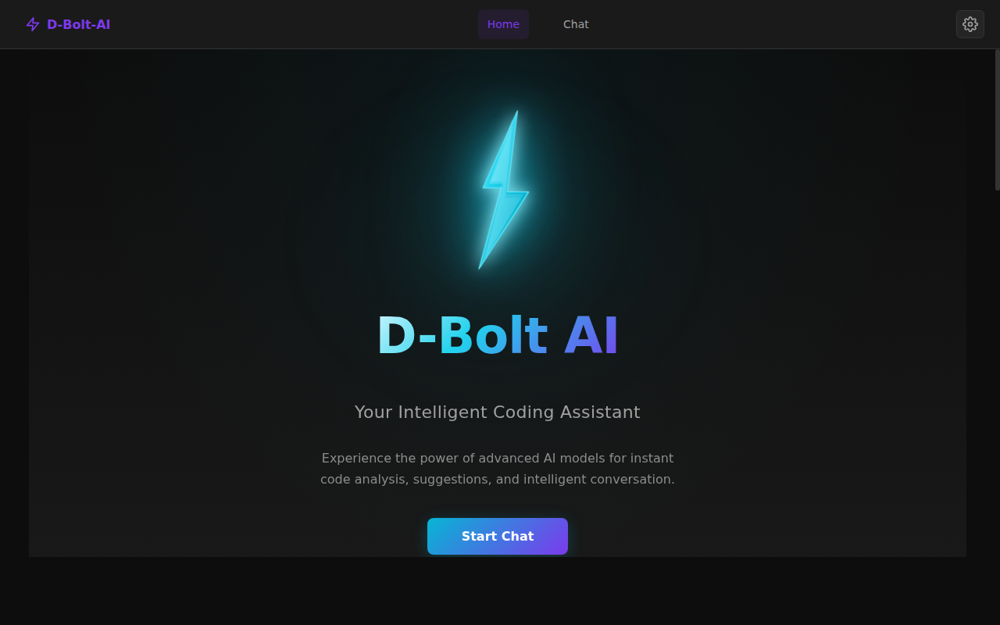
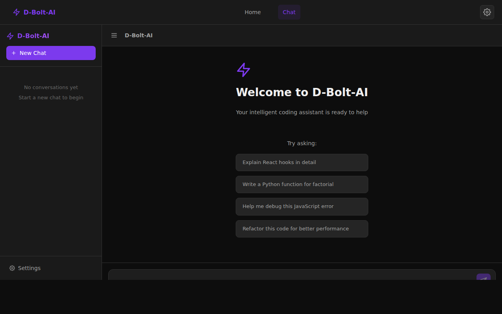

# D-Bolt-AI

D-Bolt-AI is a modern AI chat web application built with React 18 + TypeScript + Vite. It connects to multiple world-class AI models through the OpenRouter API and provides a clean, developer-focused chat interface with a full set of message management tools.

### Landing Page


### Chat Interface


## Image Analysis Feature


Upload any image directly on the landing page and get an instant AI-powered analysis streamed in real time.

- **Drag & drop or click to browse** — supports PNG, JPG, GIF, and WebP up to 10 MB
- **AI analysis via GPT-4o vision** — identifies code, diagrams, UI layouts, and visual content with detailed explanations
- **Responses stream in real time** — output appears token-by-token with a live cursor as the AI generates
- **Copy to clipboard in one click** — the **Copy** button in the result header copies the full analysis; shows a brief **Copied!** confirmation

## Features

### Image Analysis _(Landing Page)_
- **Drag & Drop Upload** — Drag an image onto the landing page drop zone or click to browse. Supports PNG, JPG, GIF, and WebP up to 10 MB.
- **Instant AI Analysis** — Powered by GPT-4o via OpenRouter. Analyzes code screenshots, UI mockups, diagrams, and any visual content.
- **Streaming Response** — The AI analysis streams in token-by-token, with a live blinking cursor while generating.
- **Copy to Clipboard** — A **Copy** button in the result header copies the full AI analysis to the clipboard with a brief **Copied!** confirmation.
- **Stop Analysis** — Cancel an in-progress analysis at any time with the Stop button.
- **Image Preview** — Uploaded images display inline before submission, with a remove (×) button to clear and start over.

### Chat Interface
- **Real-Time Streaming** — Responses stream word-by-word using the OpenRouter API with live UI updates.
- **Copy Messages** — One-click copy to clipboard for any message (user or assistant).
- **Edit User Messages** — Modify any previous user message inline and resend it to the AI.
- **Regenerate Responses** — Re-run any assistant response with full streaming support.
- **Stop Generation** — Interrupt streaming at any time to view partial output.
- **Export Chat** — Download conversations as JSON (structured data) or TXT (readable format).
- **Suggested Prompts** — Empty-state starter prompts to help users begin a conversation.
- **Typing Indicator** — Animated indicator while the AI is generating a response.

### Session & State Management
- **Persistent Sessions** — All conversations, settings, and the active session survive page reloads via Zustand's persist middleware (localStorage key: `d-bolt-ai-storage`).
- **Multi-Session Support** — Create and manage multiple independent chat conversations from the sidebar.

### Interface & UX
- **Sidebar** — Session list with new-chat creation and session switching.
- **Settings Panel** — Configure API key, model, temperature, max tokens, and system prompt.
- **Responsive Layout** — Works on desktop and mobile screens.
- **Dark Theme** — Full dark UI with CSS variable theming.

## Supported AI Models

All models are accessed via [OpenRouter](https://openrouter.ai):

| Provider   | Model              | Used For                                   |
|------------|--------------------|--------------------------------------------|
| OpenAI     | GPT-4o             | Chat · **Image analysis (vision)**         |
| OpenAI     | GPT-4o Mini        | Chat — fast, affordable for quick tasks    |
| Anthropic  | Claude 3.5 Sonnet  | Chat — detailed code explanations          |
| Anthropic  | Claude 3 Haiku     | Chat — fast responses for simple tasks     |

> **Note:** The Image Analysis feature always uses **GPT-4o** regardless of the model selected in Settings, because it is the only vision-capable model in the current lineup.

## Tech Stack

| Layer            | Technology                          |
|------------------|-------------------------------------|
| UI Framework     | React 18 + TypeScript               |
| Build Tool       | Vite                                |
| State Management | Zustand with persist middleware     |
| AI Integration   | OpenRouter API (streaming)          |
| Styling          | Custom CSS with CSS Variables       |
| Markdown         | react-markdown + syntax highlighting |
| Icons            | react-icons (Feather icon set)      |

## Project Structure

```
src/
├── components/
│   ├── ChatArea.tsx      # Main chat logic: streaming, regeneration, export, typing indicator
│   ├── ChatMessage.tsx   # Message rendering with copy, edit, and regenerate controls
│   ├── ChatInput.tsx     # Auto-expanding text input with submission handling
│   ├── Sidebar.tsx       # Session list and new-chat management
│   └── Settings.tsx      # API key, model, temperature, and system prompt configuration
├── pages/
│   ├── Landing.tsx       # Landing page + ImageAnalysisSection (upload, stream, copy)
│   └── Landing.css       # Landing page styles including drop zone and result box
├── store/
│   └── chatStore.ts      # Zustand store with persist middleware
├── types/
│   └── index.ts          # TypeScript interfaces for messages, sessions, settings
├── utils/
│   └── ai.ts             # OpenRouter API: streamCompletion (chat) + analyzeImageStream (vision)
├── App.tsx               # Root layout: sidebar, topbar, chat area, settings modal
├── App.css               # All component styles
├── index.css             # Global CSS variables, dark theme, scrollbar styles
└── main.tsx              # React entry point
```

## Development

```bash
# Install dependencies
npm install

# Start development server (port 5000)
npm run dev

# Build for production
npm run build

# Preview the production build locally
npm run preview
```

## Configuration

### OpenRouter API Key

1. Get a key from [openrouter.ai/keys](https://openrouter.ai/keys).
2. Open the app and click the **Settings** icon in the sidebar.
3. Paste your key and click **Save Settings**.

The key is stored entirely in your browser's localStorage. It is only ever sent directly to OpenRouter — never to any other server.

## How It Works

### Image Analysis Flow

1. Scroll to the **Image Analysis** section on the landing page.
2. Drag and drop an image onto the drop zone, or click it to open the file picker.
3. A preview of your image appears inside the drop zone.
4. Click **Analyze Image** — the AI (GPT-4o) begins streaming its analysis in real time.
5. Once the full response appears, click the **Copy** button (clipboard icon) in the result header to copy the analysis text to your clipboard. The button briefly shows **Copied!** to confirm.
6. To cancel mid-stream, click **Stop Analysis**. To start fresh, click the × button to remove the image.

> The image is converted to a base64 data URL in the browser and sent directly to OpenRouter — it is never stored on any server.

### Streaming Chat Message Flow

1. User types a message and presses Enter.
2. The message is added to the active session in the Zustand store.
3. All messages in the session are sent to the OpenRouter API.
4. The response streams in token-by-token, with the UI updating live.
5. On completion, the assistant message is saved to the store (and persisted to localStorage).

### State Persistence

Zustand's persist middleware serializes the following to `localStorage` under the key `d-bolt-ai-storage`:

| Field             | Description                                          |
|-------------------|------------------------------------------------------|
| `sessions`        | All conversations with their full message history    |
| `activeSessionId` | Which conversation is currently displayed            |
| `settings`        | API key, model, temperature, max tokens, system prompt |

UI-only state (`isSettingsOpen`, `isSidebarOpen`) is intentionally not persisted.

## Production Readiness

- Clean TypeScript build with no errors (`npm run build`)
- Zustand persist middleware for durable state across reloads
- Graceful streaming abort handling
- Environment-safe Vite configuration (host `0.0.0.0`, port `5000`, `allowedHosts: all`)

## Contribution Guidelines

- **Branch strategy**: All work on feature branches (`feature/description`), merged to `main` via Pull Request.
- **Main branch**: Protected — no direct commits.
- **TypeScript**: Avoid `any`; keep all interfaces in `src/types/index.ts`.
- **Styling**: Use CSS variables; maintain the dark theme throughout.
- **Components**: Keep components focused and single-responsibility.

## Known Issues

- Clearing browser data will erase all chat history (stored in localStorage).
- Some OpenRouter models may have rate limits or require credits — check your account if you see auth errors.
- Streaming requires a stable connection and JavaScript enabled.

## License

MIT License. See the LICENSE file for details.
